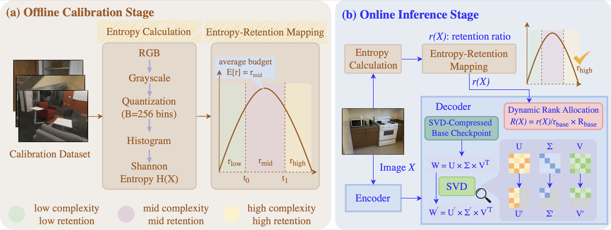

<p align="center">

</p>

<h1 align="center">SVD^3</h1>
<h2 align="center">Singular Value Decomposition for Visual Geometry Model Compression</h2>

## Environment

```bash
conda create -n SVD3 python=3.11 -y
conda activate SVD3
python -m pip install -r requirements.txt
```

Please follow the official π^3 repository to prepare datasets and change data/model path configurations accordingly in [Pi3_evaluation/configs](Pi3_evaluation/configs).


## SVD Baselines

We present two data-agnostic SVD baselines: plain SVD and data whitening SVD (also referred as W-SVD). [Pi3_main/SVDPi3.py](Pi3_main/SVDPi3.py) contains the SVD implementation for Pi3 decoder; [Pi3_evaluation/SVD_VGGT.py](Pi3_evaluation/SVD_VGGT.py) contains the SVD implementation for VGGT aggregator/decoder.

### Baseline 1: plain SVD

How to run with Pi3:

```bash
# stay in 'SVD-pi3' (root directory)
CUDA_VISIBLE_DEVICES=0 PYTHONNOUSERSITE=1 python Pi3_main/SVDPi3.py --ckpt /path/to/SVD_Pi3_cache/pi3_model.safetensors --save_path /path/to/SVD_Pi3_cache --ratio 0.2 --baseline
```

How to run with VGGT:

```bash
CUDA_VISIBLE_DEVICES=1 PYTHONNOUSERSITE=1 python Pi3_evaluation/SVD_VGGT.py --save_path /path/to/SVD_Pi3_cache --ratio 0.2 --calibration_dataset_path /path/to/scannetv2 --baseline
```

## Baseline 2: data whitening SVD

For data whitening, we need to start with collecting a calibration dataset. How to run:

For Pi3:

```bash
# stay in 'SVD-pi3' (root directory)
CUDA_VISIBLE_DEVICES=0 PYTHONNOUSERSITE=1 python Pi3_main/SVDPi3.py --ckpt /path/to/SVD_Pi3_cache/model.safetensors --save_path /path/to/SVD_Pi3_cache --ratio 0.2 --calibration_dataset_path /path/to/scannetv2 --whitening_nsamples 256
# or a diverse calibration dataset [ABLATION]
CUDA_VISIBLE_DEVICES=0 PYTHONNOUSERSITE=1 python Pi3_main/SVDPi3.py --ckpt /path/to/SVD_Pi3_cache/model.safetensors --save_path /path/to/SVD_Pi3_cache --ratio 0.2 --calibration_dataset_path diverse --whitening_nsamples 256
```


For VGGT:

```bash
CUDA_VISIBLE_DEVICES=0 PYTHONNOUSERSITE=1 python Pi3_evaluation/SVD_VGGT.py --ckpt /path/to/SVD_Pi3_cache/model.safetensors --save_path /path/to/SVD_Pi3_cache --ratio 0.2 --calibration_dataset_path /path/to/scannetv2 --whitening_nsamples 256
```

## SVD^3

For our proposed data-adaptive method SVD^3, we seamlessly integrate it into the evaluation pipeline. Here is the implementation breakdown.

### Offline Calibration

We learn entropy thresholds during offline calibration, as proposed in the paper. In particular, we implement the function ***learn_entropy_cfg_from_calib*** in [Pi3_evaluation/utils/interfaces.py](Pi3_evaluation/utils/interfaces.py) and call this function when initializing the model (Pi3 or VGGT) in the inference pipeline (such as [Pi3_evaluation/monodepth/infer.py](Pi3_evaluation/monodepth/infer.py)).

### Online Inference

We leverage the learned entropy thresholds to adaptively assign compression ratio to each input sample during inference. A code example can be the function ***adaptive_infer_monodepth*** in [Pi3_evaluation/utils/interfaces.py](Pi3_evaluation/utils/interfaces.py). The function ***rr_from_entropy*** adaptively allocates the retention ratio at inference time. The function ***set_model_rank_frac*** along with the class ***SlicableTwoFactorLinear*** implements dynamic **rank** allocation accordingly.

## Evaluation

We conduct evaluation on various types of tasks and datasets. Please configure the model path properly in yaml files at [Pi3_evaluation/configs/evaluation](Pi3_evaluation/configs/evaluation). For example, ***/path/to/SVD_Pi3_cache/Pi3_svd_baseline_0.3.safetensors*** gives you a plain SVD baseline with 30% retention ratio; ***/path/to/SVD_Pi3_cache/Pi3_whitening_only_0.2.safetensors*** gives you a data whitening baseline with 20% retention ratio; ***/path/to/SVD_Pi3_cache/Pi3_whitening_only_0.4_BASE.safetensors*** gives you our SVD^3 method in which the base model has 40% retention ratio, the high retention being 30%, mid retention being 20%, and low retention being 10%. Please refer to the paper for how/why these retention numbers are assigned.

### Monocular Depth Estimation

```bash
# stay in 'SVD-pi3' (root directory)
PYTHONNOUSERSITE=1 python Pi3_evaluation/monodepth/infer.py
PYTHONNOUSERSITE=1 python Pi3_evaluation/monodepth/eval.py
```


### Video Depth Estimation

```bash
# stay in 'SVD-pi3' (root directory)
PYTHONNOUSERSITE=1 python Pi3_evaluation/videodepth/infer.py
PYTHONNOUSERSITE=1 python Pi3_evaluation/videodepth/eval.py
```

### camera-distance

```bash
# stay in 'SVD-pi3' (root directory)
PYTHONNOUSERSITE=1 python Pi3_evaluation/relpose/eval_dist.py
```

### point-map

```bash
# stay in 'SVD-pi3' (root directory)
PYTHONNOUSERSITE=1 python Pi3_evaluation/mv_recon/eval.py
# optional visualization
PYTHONNOUSERSITE=1 python point_cloud_visualization_7scenes.py # for 7scenes
PYTHONNOUSERSITE=1 python point_cloud_visualization_nrgbd.py # for NRGBD
```

## Latency/Efficiency

[Pi3_evaluation/latency_measure.py](Pi3_evaluation/latency_measure.py) contains the code for FLOP analysis and measurement. How to run:

```bash
PYTHONNOUSERSITE=1 CUDA_VISIBLE_DEVICES=1 python Pi3_evaluation/latency_measure.py
```

[Pi3_evaluation/param_measure.py](Pi3_evaluation/param_measure.py) contains the code for parameter percentage analysis. How to run:

```bash
CUDA_VISIBLE_DEVICES=3 PYTHONNOUSERSITE=1 python Pi3_evaluation/param_measure.py
```

## Sample Results


